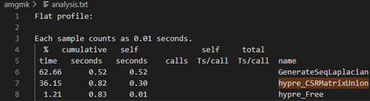

# AMG
## 1 Analysis of Flat Profile
To link the timber library and enable gprof, added the following content to the makefile.

Looking into the flat profile, we can clearly see the top three time consuming portion, which is the 3 computation task mentioned in the homework specification. Each of them is a function in their individual C program, which can be parallelized separately using OpenMP for better result. Amongst these three potential candidates, hypre_CSRMatrixMatvec and hypre_BoomerAMGSeqRelax shows better potential of improvement by occupying 41.44% and 56.08% of the total runtime respectively.


## 2 Changes Made to the Code
run `bash ./run.sh` to get all performance results for the large input image uiuc-large.pgm.
### 2.1 To hypre_BoomerAMGSeqRelax
Made changes to file `scr_matvec.c`. Added parallel task for the for loop on line 76 in file relax.c, i, jj, ii are declared private and res reduction (is like private in this case, but faster).
```cpp
#pragma omp parallel for default(shared) private(i, jj, ii) reduction (-:res)
   for (i = 0; i < n; i++)	/* interior points first */
   {
     
     /*-----------------------------------------------------------
      * If diagonal is nonzero, relax point i; otherwise, skip it.
      *-----------------------------------------------------------*/ 
     
     if ( A_diag_data[A_diag_i[i]] != 0.0)
     {
       res = f_data[i];
       for (jj = A_diag_i[i]+1; jj < A_diag_i[i+1]; jj++)
       {
	      ii = A_diag_j[jj];
	      res -= A_diag_data[jj] * u_data[ii];
       }
       u_data[i] = res / A_diag_data[A_diag_i[i]];
     }
   }
```
### 2.2 To hypre_CSRMatrixMatvec
Made several changes to file `csr_matvec.c`.
On line 107, added parallel task with default shared and private i.
```cpp
if (alpha == 0.0)
    {
       #pragma omp parallel for default(shared) private(i)
       for (i = 0; i < num_rows*num_vectors; i++)
          y_data[i] *= beta;

       return ierr;
    }
```
On line 124 and 129, added parallel task with default shared and private i.
```cpp
if (temp != 1.0)
   {
      if (temp == 0.0){
         #pragma omp parallel for default(shared) private(i)
	      for (i = 0; i < num_rows*num_vectors; i++)
	         y_data[i] = 0.0;
      }
      else{
         #pragma omp parallel for default(shared) private(i)
	      for (i = 0; i < num_rows*num_vectors; i++)
	         y_data[i] *= temp;
      }
   }
```
On line 143, added parallel task with default shared, private i, jj, m, j and reduction tempx.
```cpp
if (num_rownnz < xpar*(num_rows))
   {
      #pragma omp parallel for default(shared) private(i, jj, m, j) reduction(+:tempx)
      for (i = 0; i < num_rownnz; i++)
      {
         m = A_rownnz[i];

         /*
          * for (jj = A_i[m]; jj < A_i[m+1]; jj++)
          * {
          *         j = A_j[jj];   
          *  y_data[m] += A_data[jj] * x_data[j];
          * } */
         if ( num_vectors==1 )
         {
            tempx = y_data[m];
            for (jj = A_i[m]; jj < A_i[m+1]; jj++) 
               tempx +=  A_data[jj] * x_data[A_j[jj]];
            y_data[m] = tempx;
         }
         else
            for ( j=0; j<num_vectors; ++j )
            {
               tempx = y_data[ j*vecstride_y + m*idxstride_y ];
               for (jj = A_i[m]; jj < A_i[m+1]; jj++) 
                  tempx +=  A_data[jj] * x_data[ j*vecstride_x + A_j[jj]*idxstride_x ];
               y_data[ j*vecstride_y + m*idxstride_y] = tempx;
            }
      }

   }
```
On line 174, added parallel task with default shared, private i, jj, j and reduction temp.
```cpp
else
   {
      #pragma omp parallel for default(shared) private(i, jj, j) reduction(+:temp)
      for (i = 0; i < num_rows; i++)
      {
         if ( num_vectors==1 )
         {
            temp = y_data[i];
            for (jj = A_i[i]; jj < A_i[i+1]; jj++)
               temp += A_data[jj] * x_data[A_j[jj]];
            y_data[i] = temp;
         }
         else
            for ( j=0; j<num_vectors; ++j )
            {
               temp = y_data[ j*vecstride_y + i*idxstride_y ];
               for (jj = A_i[i]; jj < A_i[i+1]; jj++)
               {
                  temp += A_data[jj] * x_data[ j*vecstride_x + A_j[jj]*idxstride_x ];
               }
               y_data[ j*vecstride_y + i*idxstride_y ] = temp;
            }
      }
   }
```
On line 204, added parallel task with default shared and private i.
```cpp
if (alpha != 1.0)
   {
      #pragma omp parallel for default(shared) private(i)
      for (i = 0; i < num_rows*num_vectors; i++)
	   y_data[i] *= alpha;
   }
```
### 2.3 To hypre_SeqVectorAxpy
Made changes to file `vector.c`.
On line 383, added parallel task with default shared and private i.
```cpp
#pragma omp parallel for default(shared) private(i)
   for (i = 0; i < size; i++)
      y_data[i] += alpha * x_data[i];
```
### 2.4 Further Performance Optimization
After making the previous changes, the new flat profile indicate that there are other functions that could be further optimized.



Hence the following changes were made to file `laplace.c`:

On line 73, added parallel task with default shared and private i.
```cpp
#pragma omp parallel for default(shared) private(i)
   for (i=0; i < grid_size; i++)
   {
      x_data[i] = 0.0;
      sol_data[i] = 0.0;
      rhs_data[i] = 1.0;
   }
```
On line 166, added parallel task with default shared and private i, j.
```cpp
#pragma omp parallel for default(shared) private(i, j)
   for (i=0; i < grid_size; i++)
      for (j=A_i[i]; j < A_i[i+1]; j++)
          sol_data[i] += A_data[j];
```
## 3 Performance Comparison
### 3.1 Runtime With Different Thread Count
| Number of Threads	| MATVEC (seconds)	| Relax (Seconds) |	Axpy (Seconds) |	Total Wall Time (Seconds) |
|:----|:----|:----|:----|:----|
| Sequential |	1.00 |	1.00 |	1.00 |	1.00 |
| 1 | 1.00 | 0.90 |	0.90 | 0.94 |
| 2 | 1.95 | 1.82 |	2.31 | 1.87 |
| 4	| 3.69 | 3.48 |	4.93 | 3.52 |
| 8	| 6.65	| 7.04 | 7.40 | 6.04 |

### 3.2 Speed Up Achieved With Different Thread Count
| Number of Threads	| MATVEC (speedup)	| Relax (speedup) |	Axpy (speedup) |	Total Wall Time (speedup) |
|:----|:----|:----|:----|:----|
| Sequential |	1.077 |	1.444 |	0.074 |	2.616 |
| 1 |	1.080 |	1.588 |	0.082 |	2.774 |
| 2 |	0.552 |	0.793 |	0.032 |	1.398 |
| 4	| 0.292 |	0.414 |	0.015 |	0.742 |
| 8	| 0.162	| 0.205 |	0.010	| 0.433 |

We can see that the speed up is proportional to the number of threads, with higher number of threads have better performance. 

