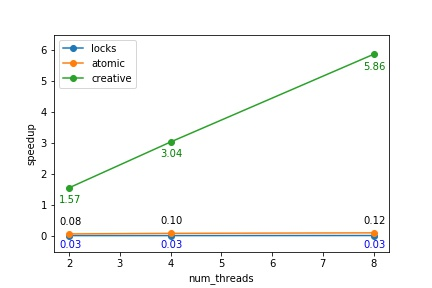

# Project Report
# Histogram
## 1 process
### 1.1 Code of four approaches inside for 'm' loop
Origin:
```
for (i=0; i<image->row; i++) {
    for (j=0; j<image->col; j++) {
        histo[image->content[i][j]]++;
    }
}
```

Locks:
```
// initialize array of locks
omp_lock_t lock[256];
for (i=0; i<256; i++) {
    omp_init_lock(&lock[i]);
}
# pragma omp parallel for collapse(2) default(shared) private(i, j)
for (i=0; i<image->row; i++) {
    for (j=0; j<image->col; j++) {
    // lock access to single array element
    omp_set_lock(&lock[image->content[i][j]]);
    histo[image->content[i][j]]++;
    omp_unset_lock(&lock[image->content[i][j]]);
    }
}
// destroy locks
for (i=0; i<256; i++) {
    omp_destroy_lock(&lock[i]);
}
```

Atomic:
```
# pragma omp parallel for collapse(2) default(shared) private(i, j)  
for (i=0; i<image->row; i++) {
    for (j=0; j<image->col; j++) {
    # pragma omp atomic update
    histo[image->content[i][j]]++;
    }
}
```

Creative: use reduction
```
# pragma omp parallel for collapse(2) default(shared) private(i, j) reduction(+: histo[0:256])
for (i=0; i<image->row; i++) {
    for (j=0; j<image->col; j++) {
    histo[image->content[i][j]]++;
    }
}
```

## 2 results
run `bash ./run.sh` to get all performance results for the large input image uiuc-large.pgm.
### 2.1 validation
`diff validation-large.out ./reault/*.out` is used to check the correctness.
There are no differences between validation file validation-large.out and output files except for the runtime.
### 2.2 execution time record
run `bash ./show_result.sh` to see results for this report. Results are shown in table below.
| num_threads | sequential | locks | atomic | creative |
|:----|:----|:----|:----|: ----|
| 2 | 5.63s | 201.29s | 68.76s | 3.59s |
| 4 | 5.62s | 202.74s | 56.39s | 1.85s |
| 6 | 5.63s | 186.70s | 48.09s | 0.96s |

speedup = sequential execution time / parallel execution time. Speedup curves are shown in picture below.

### 2.3 performance observation
The creative version which we utilized provided efficient code for sum by specifying "reduction(+: array)" performs best and gives the largest speedup. For the required methods, the sequential method gives the shortest time and best performance. Speedup increases with number of threads for atomic and creative methods while doesn't change much for sequential and locks methods.
That's because when using locks, no matter how much number of threads are used, every operation of adding 1 to the element should wait for the completion of addition of other threads, causing constantly high value of running time. There are also extra instructions to communicate between threads and determine whether the lock is unset, which make the performance worse.
Regarding atomic method, threads still need to synchronize to avoid race condition which means parallelism is lost. However, the compiler uses special hardware instructions to reduce overhead of entering and exiting code when lock and unlock. Therefore, it shows better performance than locks method.
Reduction for sum allocates a copy of element per thread. The local element won't be influnenced by other threads thus avoid writing to the same location simultaneously. Since each thread is operating seperately, we don't need lock and atomic to wait for finishing instructions from other threads and fully utilized the parallel execution time. Finally this method combines per-thread copies into original element to ensure the correct results.
