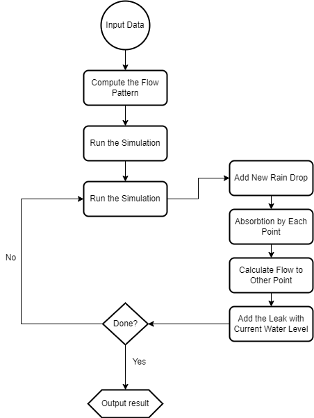

# Project Report
# Members
 Meihong Ge mg476 / Wenxin Xu wx65
## 1 Sequantial Portion
The overall flow of the algorithm follows the flow chart shown below. 

Most processes are quite straight forward, but there are two key steps need some attention. First one being the ***Compute the Flow Pattern***. Since the flow of water in our scenario only take the height of point on the grid, we get to precompute the flow pattern before the simulation, so we don’t have to do it during each iteration. 

Each point has a `vector` that contains the coordinates of neighbors that water will flow to given there is enough of them. The coordinate is represented in `pair<int, int>` while the vector itself function like a `monotone stack`. That is, if a neighbor has a height lower than the top element (then its lower than all the element in the stack), the stack is cleared, and this neighbor’s coordinate is pushed into the stack. Neighbor with same height is added without pop and neighbor with larger height is ignored.

Another important thing is ***Add the Leak with Current Water Level***. When running the simulation, an important catch is that water flowing from one point to other points only happens when all the absorption step is done on each spot on the grid. If such rule is not adhered to, error will occur that might result in infinite loop. To prevent this, a temporary `matrix (2-D vector)` is created to store the amount of water that is about to flow into a certain spot at each time step. The actual change to water level only happens when this time step ends.

## 2 Parallel Portion
### 2.1 Parallelization strategy
The task for one timestep is divided and parallelized, i.e., during whole computation, the grids are divided into N (==number of threads) groups by rows and each time one thread is in charge of compute the drops inside one part for the current step. The reason is that the deviation of water for each grid is based on the previous water level of its neighbors, meaning it is not able divide the tasks by timesteps. In one timestep, there are generally three types of dividing methods: by rows, by columns and by rectangles. Choosing to divide the whole map by rows aims to increase spatial locality and makes it easy to deal with odd number of threads.

`pthread_mutex` and `pthread_barrier` are used across threads. The value of water changed for each grid in this step is guranteed to be right using a mutex because at the edge of different groups, there are chances that neighboring threads try to update the level_change value simutaneously. Barriers are used to make sure all threads have reached the same statement and can go on to next step or make sure setting global property to same value before changing it. They take effect under three conditions:
1. Water changed for every grid has been calculated. Reason for this barrier is to prevent the situation that faster thread updates its edge grids before water in the slower thread is calculated flowing into the grids.
2. Before checking if we should end the whole absorbing process by `all_done`, set the global `all_done` property to true. Reason for this barrier is to prevent slower thread to set `all_done` to true after faster thread has detect remaining drop in grid and set it to false.
3. Water changed for every grid has been performed. Every grid has been checked if there is remaining water and set `all_done` and local `step` value accordingly. Reason for this barrier is to make sure `all_done` has been set to the right value before faster thread check whether to enter a new loop.

### 2.2 Performance evaluation
| N\P (sec) | seq | 1 | 2 | 4 | 8 |
|:----|:----|:----|:----|:----|:----|
| 4 | 0.001435 | 0.000913 | 0.006824 | 0.017572 | 0.034942 |
| 16 | 0.006074 | 0.005681 | 0.008895 | 0.021562 | 0.032911 |
| 32 | 0.021358 | 0.024565 | 0.035701 | 0.031111 | 0.047868 |
| 128 | 1.21632 | 2.16579 | 1.18346 | 0.808377 | 0.767389 |
| 512 | 3.08783 | 5.21051 | 3.07505 | 1.888 | 1.37834 |
| 2048 | 208.043 | 237.061 | 130.673 | 76.088 | 50.7756 |
| 4096 | 1267.54 | 1428.6 | 782.907 | 450.855 | 289.454 |

From results above, we can observe that for larger input size, speedups can be obtained compared to sequential ones. The time with parallel code is able to exceed sequential results with enough threads working together while remains smaller than the parallel results with only one thread. More threads will lead to less time and larger speedup. For smaller size, the speedup is smaller and even can not be obtained with N <= 32.

The observation conforms to the expectation as parallel program introduces more variables and function calls thus it takes time to communiate with other threads. Therefore, the time saved by parrallel computing may not make up the additional time consumed with a small main part.